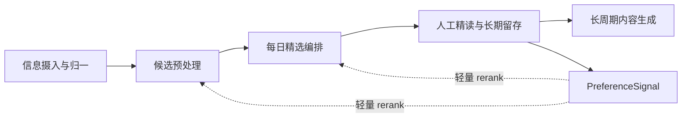

# 漏斗式阅读工作流实现说明

## 1. 文档目的

本文档用于指导后续从零实现“漏斗式阅读工作流”。

约束如下：

- 不复用当前仓库里的既有实现
- 以个人系统为第一目标，而不是平台化产品
- 顶层按业务工作流切，不按原子能力切
- 反馈、画像、评估、编排不单列为业务 workflow
- 先定义契约和边界，再进入具体脚本与工具实现

这份文档应当独立成立。即使后续清空当前仓库，也可以仅凭本文档重建系统。

## 2. 设计总览

### 2.1 顶层工作流

系统采用 5 个顶层 workflow skill：

1. `ingest-normalize`
2. `digest-candidates`
3. `compose-daily-review`
4. `curate-retain`
5. `generate-long-cycle-assets`

### 2.2 横切支撑层

横切层不作为顶层业务 workflow 暴露，但必须从第一天开始设计：

1. 对象与状态契约
2. Human-in-the-loop 决策面
3. 反馈与画像机制
4. 评估与观测

### 2.3 总体流转



## 3. 从零开始的仓库结构

推荐采用下面的目录结构：

```text
project/
|-- skills/
|   |-- ingest-normalize/
|   |   |-- SKILL.md
|   |   |-- run.py
|   |   |-- references/
|   |   |-- scripts/
|   |   |-- templates/
|   |   |-- data/
|   |   `-- evals/
|   |-- digest-candidates/
|   |-- compose-daily-review/
|   |-- curate-retain/
|   `-- generate-long-cycle-assets/
|-- schemas/
|-- docs/
|   |-- reading-funnel-global-implementation-guide.md
|   |-- reading-funnel-object-contracts.md
|   |-- reading-funnel-orchestration-rules.md
|   |-- reading-funnel-evaluation-rules.md
|   `-- reading-funnel-review-checklists.md
|-- scripts/
|   |-- run_reading_funnel_local.ps1
|   `-- build_pipeline_run.py
|-- config/
|   |-- source-adapters.example.json
|   |-- daily-review.example.json
|   `-- retention-policy.example.json
`-- tests/
```

原则如下：

- `skills/` 只放顶层 workflow skill
- `schemas/` 是对象契约的 source of truth
- `docs/` 只放架构、契约、流程、评估、评审规则
- `scripts/` 只放非业务顶层的编排脚本与 run 汇总脚本
- 不再把“原子能力”直接暴露成顶层 skill

## 4. 抽象角色

实现前先定义 6 个抽象角色。后续再把具体工具映射进去。

### 4.1 SourceAdapter

职责：

- 从外部来源读取内容
- 把来源条目转成统一输入格式
- 不负责去重、摘要、精选

可选实现：

- RSS
- RSSHub / RSS-Bridge
- GitHub Feed
- 自定义抓取器

### 4.2 SourcePool

职责：

- 承接所有已归一的信息输入
- 为后续预处理提供统一候选池

### 4.3 ReviewComposer

职责：

- 从 Digest 候选中生成当日可读成稿
- 负责编排，不负责长期价值判断

### 4.4 KnowledgeStore

职责：

- 接收人工确认后的高价值内容
- 存储长期知识资产

### 4.5 PreferenceEngine

职责：

- 从留存和行为记录中提炼轻量偏好信号
- 只做 rerank，不做强推荐

### 4.6 Orchestrator

职责：

- 编排各个 workflow skill
- 管理调度、输入输出路径和 run 汇总
- 不承担业务真相

## 5. 对象契约

对象契约必须先定，再实现脚本。

每个对象必须具备：

- 逻辑身份
- 运行快照身份
- 来源追溯关系
- 状态字段
- 上下游引用关系

### 5.1 SourceEntry

定义：进入系统后的来源条目快照。

建议字段：

- `source_entry_id`
- `source_entry_snapshot_id`
- `source_adapter_type`
- `source_id`
- `source_name`
- `origin_item_id`
- `title`
- `url`
- `summary`
- `author`
- `published_at`
- `fetched_at`
- `raw_payload`
- `run_id`
- `status`

状态枚举：

- `INGESTED`
- `FETCH_FAILED`
- `FILTERED_AT_SOURCE`

### 5.2 NormalizedCandidate

定义：完成基本归一化后的可预处理候选对象。

建议字段：

- `normalized_candidate_id`
- `source_entry_id`
- `canonical_url`
- `url_fingerprint`
- `title`
- `normalized_title`
- `summary`
- `language`
- `published_at`
- `source_id`
- `source_name`
- `normalize_status`
- `run_id`

状态枚举：

- `NORMALIZED`
- `NORMALIZE_FAILED`

### 5.3 DigestCandidate

定义：经过清洗、去重、聚类、摘要、初排后的候选对象。

建议字段：

- `digest_candidate_id`
- `normalized_candidate_ids`
- `primary_normalized_candidate_id`
- `cluster_type`
- `cluster_confidence`
- `display_title`
- `display_summary`
- `canonical_url`
- `quality_score`
- `freshness_score`
- `digest_score`
- `noise_flags`
- `needs_review`
- `digest_status`
- `run_id`

状态枚举：

- `KEPT`
- `FILTERED`
- `NEEDS_REVIEW`

### 5.4 DailyReviewIssue

定义：某次日报编排的结构化成稿对象。

建议字段：

- `daily_review_issue_id`
- `issue_date`
- `sections`
- `top_themes`
- `editorial_notes`
- `source_digest_candidate_ids`
- `render_status`
- `run_id`

其中 `sections` 应包含固定栏目：

- `今日大事`
- `变更与实践`
- `安全与风险`
- `开源与工具`
- `洞察与数据点`
- `主题深挖`

状态枚举：

- `COMPOSED`
- `NEEDS_EDITOR_REVIEW`

### 5.5 RetentionDecision

定义：人工精读后的价值确认结果。

建议字段：

- `retention_decision_id`
- `target_type`
- `target_id`
- `decision`
- `confidence`
- `reason_tags`
- `reason_text`
- `decision_at`
- `decision_by`
- `run_id`

状态枚举：

- `KEEP`
- `DROP`
- `DEFER`
- `NEEDS_RECHECK`

### 5.6 KnowledgeAsset

定义：进入长期知识库的高价值资产。

建议字段：

- `knowledge_asset_id`
- `origin_retention_decision_id`
- `title`
- `summary`
- `canonical_url`
- `topic_tags`
- `asset_type`
- `long_term_value_reason`
- `stored_at`
- `run_id`

状态枚举：

- `STORED`
- `ARCHIVED`

### 5.7 PreferenceSignal

定义：从留存与行为中提炼出的轻量偏好信号。

建议字段：

- `preference_signal_id`
- `signal_type`
- `signal_value`
- `weight`
- `derived_from`
- `expires_at`
- `run_id`

信号类型示例：

- `TOPIC_PREFERENCE`
- `SOURCE_PREFERENCE`
- `FORMAT_PREFERENCE`
- `NEGATIVE_SIGNAL`
- `PUBLIC_IMPORTANCE_OVERRIDE`

约束：

- 只能参与 rerank
- 不能单独决定是否保留公共重要内容

### 5.8 LongCycleAsset

定义：周刊或专题的长周期输出对象。

建议字段：

- `long_cycle_asset_id`
- `asset_scope`
- `title`
- `summary`
- `source_knowledge_asset_ids`
- `source_daily_review_issue_ids`
- `theme_ids`
- `asset_status`
- `generated_at`
- `run_id`

范围枚举：

- `WEEKLY`
- `TOPIC`

状态枚举：

- `READY`
- `NEEDS_AUTHOR_REVIEW`

### 5.9 PipelineRun

定义：一次完整编排运行的总索引。

建议字段：

- `pipeline_run_id`
- `started_at`
- `finished_at`
- `run_status`
- `step_results`
- `artifact_index`
- `issues`
- `config_hashes`

状态枚举：

- `SUCCEEDED`
- `PARTIAL_SUCCESS`
- `FAILED`

## 6. 五个顶层 workflow skill 的完整说明

## 6.1 ingest-normalize

### 统一用户任务

把多源内容接入系统，并转成统一候选池。

### 边界

负责：

- 来源发现与订阅管理
- 非 RSS 来源转 feed
- 来源拉取与时间窗控制
- 来源字段映射
- 原始条目落盘
- 基础归一化

不负责：

- 去重
- 正文抽取
- 摘要生成
- 排序
- 日报成稿

### 主产物

- `normalized-candidates.json`

### 辅助产物

- `source-entries.json`
- `ingest-report.json`
- `step-manifest.json`

### 内部原子能力

- `discover_sources`
- `sync_source_window`
- `convert_to_feed`
- `map_source_fields`
- `persist_source_entries`
- `normalize_candidates`
- `record_ingest_failures`

### 成功定义

- 至少拉到一个有效来源
- 至少产出一个 `NormalizedCandidate`
- 来源失败被显式记录

## 6.2 digest-candidates

### 统一用户任务

把原始候选转成“可判断对象”。

### 边界

负责：

- URL 规范化复核
- 精确去重
- 相似内容聚类
- 正文抽取
- 内容清洗
- 质量检查
- 噪音过滤
- 摘要生成
- 初步排序
- Digest 装配

不负责：

- 日报栏目编排
- 长期价值判断
- 知识库存储

### 主产物

- `digest-candidates.json`

### 辅助产物

- `digest-review.json`
- `digest-report.md`
- `step-manifest.json`

### 内部原子能力

- `canonicalize_url`
- `exact_dedup`
- `near_duplicate_cluster`
- `extract_main_content`
- `clean_content`
- `check_quality`
- `filter_noise`
- `generate_summary`
- `compute_digest_score`
- `assemble_digest_candidates`

### 成功定义

- 候选池被显式收窄
- 重复与噪音被记录
- 每个可继续候选都有摘要和分数

## 6.3 compose-daily-review

### 统一用户任务

把 Digest 候选编排成当天真正值得读的成稿。

### 边界

负责：

- 候选合并与事件级归并
- 栏目分类
- 核心主题提炼
- 当日重要性判断
- 深挖主题识别
- 日报结构编排
- 人类可读成稿生成

不负责：

- 长期价值确认
- 人工留存决策
- 长周期内容生成

### 主产物

- `daily-review-issues.json`

### 辅助产物

- `daily-review.md`
- `step-manifest.json`

### 内部原子能力

- `merge_same_event_candidates`
- `classify_sections`
- `identify_top_themes`
- `score_daily_importance`
- `detect_deep_dive_topics`
- `compose_issue_structure`
- `render_human_readable_issue`

### 成功定义

- 输出是“日报成稿”，不是候选列表
- 每条内容有明确栏目归属
- 每期 issue 有主题与结构

## 6.4 curate-retain

### 统一用户任务

确认长期价值，并把高价值内容沉淀为长期知识资产。

### 边界

负责：

- 待精读候选生成
- 人工确认入口
- 留存/不留存决策记录
- 长期价值标签
- 知识库写入
- 决策理由沉淀
- 偏好信号派生

不负责：

- 上游候选清洗
- 日报编排
- 周刊或专题成稿

### 主产物

- `retention-decisions.json`

### 辅助产物

- `knowledge-assets.json`
- `preference-signals.json`
- `curation-report.md`
- `step-manifest.json`

### 内部原子能力

- `build_read_queue`
- `capture_human_decision`
- `persist_retention_decision`
- `derive_long_term_tags`
- `store_knowledge_asset`
- `derive_preference_signals`

### 成功定义

- 人工确认点清楚
- 留存与不留存都有显式记录
- 偏好信号从决策中派生，而不是从猜测中派生

## 6.5 generate-long-cycle-assets

### 统一用户任务

把累计沉淀转成周尺度或专题尺度的高价值输出。

### 边界

负责：

- 周期素材汇总
- 热门主题累计
- 长期信号识别
- 周刊结构生成
- 专题可写性判断
- 主题文章素材装配

不负责：

- 上游摄入
- 上游候选预处理
- 人工留存判定

### 主产物

- `long-cycle-assets.json`

### 辅助产物

- `long-cycle-report.md`
- `step-manifest.json`

### 内部原子能力

- `collect_period_assets`
- `detect_hot_topics`
- `identify_long_signals`
- `compose_weekly_assets`
- `evaluate_topic_writability`
- `assemble_topic_asset_bundle`

### 成功定义

- 周刊与专题都来自已有沉淀，而不是重新抓热点
- 每个长周期产物都能追溯来源

## 7. 顶层 skill 触发设计

每个 skill 的 `SKILL.md` 都应只描述：

- 这个 workflow 做什么
- 什么时候触发
- 不该什么时候触发
- 输出物是什么
- 需要加载哪些 references / scripts / templates / data

不要在 `SKILL.md` 中塞入大段领域知识。

### 建议 description

#### ingest-normalize

接入 RSS、feed 或其他可转换来源，并把来源条目归一为统一候选池；当用户要求同步信息源、导入候选内容、建立统一阅读入口时使用。

#### digest-candidates

将原始候选做去重、抽取、质检、摘要和初排，转成可判断的 Digest 候选；当用户要求整理候选池、过滤噪音、生成 Digest 时使用。

#### compose-daily-review

从 Digest 候选中编排出日报成稿和固定栏目内容包；当用户要求生成每日精选、日报或重点阅读清单时使用。

#### curate-retain

记录人工精读后的留存决策，沉淀长期知识资产，并派生轻量偏好信号；当用户要求确认长期价值、写入知识库或整理留存记录时使用。

#### generate-long-cycle-assets

根据日报、留存资产和长期主题累计，生成周刊或专题素材包；当用户要求输出周刊、专题文章素材或长周期内容时使用。

## 8. 编排规则

## 8.1 调度方式

建议采用三类触发：

- 定时触发
- 事件触发
- 人工触发

### 定时触发

- `ingest-normalize`
- `digest-candidates`
- `compose-daily-review`
- `generate-long-cycle-assets`

### 事件触发

- 来源同步完成后触发 Digest
- Digest 完成后触发 Daily Review

### 人工触发

- `curate-retain`
- 专题文章确认
- 高价值主题确认

## 8.2 Human-in-the-loop 位置

必须保留以下人工确认点：

1. 精读前确认
2. 留存前确认
3. 高价值主题确认
4. 负反馈记录
5. 误判纠偏

禁止用纯自动规则替代“长期价值判断”。

## 8.3 Run 级汇总

`PipelineRun` 由独立脚本汇总，不作为顶层 workflow skill。

建议汇总内容：

- 本次运行的 5 个 workflow step manifest
- 主产物索引
- 失败与低置信度对象索引
- 配置哈希
- 可回放输入路径

## 9. 反馈与画像规则

反馈层只做辅助，不做统治。

### 9.1 允许采集的信号

- 点开未读完
- 读完未收藏
- 值得精读
- 值得长期沉淀
- 影响写作
- 影响决策
- 影响实际实现
- 明确负反馈

### 9.2 信号使用规则

- 只能 rerank，不能 hard filter 公共重要内容
- 不能让系统退化为“猜你喜欢”
- 必须保留探索未知主题的空间
- 公共重要性优先级高于个人偏好

### 9.3 偏好更新节奏

建议采用“轻量、慢更新”：

- Digest rerank 可日更
- Daily Review rerank 可日更
- Topic 偏好建议周更
- 强偏好模型不得实时放大

## 10. 评估与观测

每个 workflow 都必须同时定义：

- 成功标准
- 空结果语义
- 失败落盘
- 低置信度标记
- 可回放输入
- 人工复盘入口

## 10.1 触发评估

每个顶层 skill 至少准备：

- `should-trigger` 8 到 10 条
- `should-not-trigger` 8 到 10 条
- `near-miss` 4 到 6 条

## 10.2 工作流评估

每个 workflow 至少覆盖：

- happy path
- ambiguous path
- failure path
- empty result path

## 10.3 关键指标

建议长期追踪：

- 来源接入成功率
- 候选去重比例
- 噪音过滤比例
- Digest 候选命中率
- Daily Review 读后保留率
- 留存转知识资产率
- 偏好信号命中率
- 周刊/专题复用率

## 11. 实现阶段顺序

不要同时铺开全部能力。按下面顺序实现。

### Phase 0：骨架搭建

目标：

- 建立 5 个顶层 skill 目录
- 建立对象 schema
- 建立 step-manifest 与 pipeline-run 规则
- 建立空模板和空 evals

交付物：

- 目录骨架
- 9 类核心对象 schema
- 编排说明文档

### Phase 1：摄入与 Digest

目标：

- 实现 `ingest-normalize`
- 实现 `digest-candidates`

交付物：

- 统一候选池
- Digest 候选
- 失败和 review 报告

### Phase 2：Daily Review

目标：

- 实现 `compose-daily-review`
- 固定栏目与成稿模板落地

交付物：

- 日报结构化产物
- 人类可读日报

### Phase 3：人工留存

目标：

- 实现 `curate-retain`
- 明确 human-in-the-loop 入口

交付物：

- 留存决策
- 知识资产
- 偏好信号

### Phase 4：长周期输出

目标：

- 实现 `generate-long-cycle-assets`

交付物：

- 周刊素材包
- 专题素材包

### Phase 5：反馈调优

目标：

- 优化 PreferenceSignal 的派生与 rerank 使用

交付物：

- 反馈规则文档
- 画像更新策略
- 基线对比结果

## 12. 明确不做

当前全局方案中，不应提前实现：

- 强推荐引擎
- 全自动长期价值判断
- 为了复用而过早平台化
- 把每个原子能力拆成顶层 skill
- 在 `SKILL.md` 中堆积大量知识文本
- 让编排器承担业务真相

## 13. 最终实施原则

如果后续只记住一句话，就记住这一句：

> 顶层按工作流暴露，底层按原子能力实现，长期价值判断保留给人，反馈只做轻量回流。

