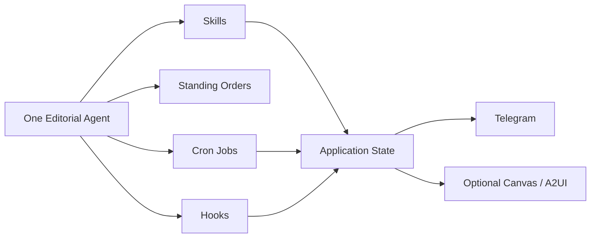

# Design: OpenClaw StoryPack Inbox Phase 1.3

Generated: 2026-03-23  
Status: Draft  
Mode: Builder  
Supersedes:
- `C:\Users\lzk\.gstack\projects\agents\lzk-main-design-20260323-100531.md`
- [04-openclaw-patterns-evaluation.md](E:\File\self\github\agents\planning\openclaw-storypack-inbox\04-openclaw-patterns-evaluation.md)

## Problem Statement

Phase 1 的目标不是做一个“大而全的信息平台”，而是做一个由 OpenClaw 编排的个人编辑系统：

- 从稳定来源持续摄入内容
- 将内容收敛成可判断的 `StoryPack`
- 每天只给用户少量高信号内容
- 在 Telegram 完成交付和第一轮反馈
- 把高价值判断沉淀为后续筛选信号

核心承诺是：

`每天帮你把世界压缩成几条你能判断、能记住、未来能表达的东西。`

## Phase 1 Scope

### In Scope

- Source Registry
- Feed-based ingestion
- Canonical item normalization
- StoryPack builder
- Review queue
- Telegram digest delivery
- Telegram inline feedback
- Feedback log and projections
- `why_it_matters_today`
- `one_line_thesis`
- `mark_for_publish`
- `quiet_but_useful`
- memory write-through for selected outcomes

### Not In Scope

- Browser/Scrapling as default ingestion path
- Automatic Xiaohongshu or multi-platform publishing
- Full card/article generator
- Full `Theme / Beat` entity layer
- Multi-user auth and permissions
- A standalone admin-style web app as a Phase 1 requirement

## OpenClaw Role And Boundaries

OpenClaw 在这套系统里是 runtime and orchestration layer，不是业务真相存储层。

### OpenClaw owns

- agent runtime
- skills
- standing orders
- cron jobs
- hooks
- channels such as Telegram
- optional Canvas / A2UI surfaces
- operator memory and persistent execution context

### Application state owns

- `StoryPack`
- `FeedbackEvent`
- `DeliveryArtifact`
- `ReviewQueueSnapshot`
- provenance and evidence records
- ranking inputs and projections

### Design rule

`OpenClaw memory is for durable operator context, not for StoryPack lifecycle truth.`

## Repository Delivery Model

这个项目的最终交付形态不是“给 OpenClaw 一堆零散文档再手动配置”，而是：

`把 GitHub 仓库地址交给 OpenClaw 后，它应该能根据仓库结构、README、agent 配置、skills 目录和文档，自行完成安装与接线。`

这意味着仓库本身必须是一个 self-describing, self-bootstrap package。

### Repository-level requirements

- repo root 必须清楚表达安装入口
- OpenClaw 相关目录必须可被直接发现
- skills 必须跟仓库一起分发，而不是依赖人工补装
- agent 配置、standing orders、cron、hooks、memory layout 约定必须在仓库内可读
- README 必须能充当 “OpenClaw 初始安装说明”

### Design implication

Phase 1 不只是设计运行时对象，还要设计仓库结构本身。

## OpenClaw-native Runtime Model

Default runtime model:



### Default architecture choice

- one editorial agent
- multiple narrow skills
- cron for scheduled runs
- standing orders for durable editorial instructions
- hooks for lightweight automation glue
- explicit app state for business truth

### Multi-agent policy

Multi-agent is optional, not default.

Only add another agent when there is a real isolation boundary:

- different credentials
- different workspace
- different routing identity
- different sandbox/tool policy

Examples that may justify a second agent later:

- browser-heavy fetcher
- social publisher with separate platform auth

## Core Product Loop

```text
Sources
  -> Raw Items
  -> Canonical Items
  -> StoryPacks
  -> Review Queue
  -> Delivery Artifacts
  -> Telegram
  -> Feedback Events
  -> StoryPack projections / ranking inputs
  -> Memory write-through for selected outcomes
```

## Interaction Surface Strategy

### Surface priority

1. Telegram
2. Canvas / A2UI
3. Custom web UI

### Why

- Telegram is already the first delivery surface and should also be the first approval surface
- Canvas / A2UI is the first custom visual surface to consider inside OpenClaw
- a custom `/sources /inbox /delivery` app is optional product UI, not a Phase 1 assumption

### Phase 1 interaction rule

`approve / reject / snooze / mark_for_publish` must work in Telegram first.

If a richer review console is needed later, it should sit on top of the same state contracts rather than invent new ones.

## Pattern Mapping

| Stage | Pattern | OpenClaw primitive | Notes |
|---|---|---|---|
| Source fetch | Workflow + Routing | Skill + Cron | Default `feed`; later branch to browser or Scrapling |
| Extraction | Parallel | Skill | Safe fan-out zone |
| Canonicalization | Workflow | Skill | Deterministic transformation |
| StoryPack update | Workflow + Custom Logic | Skill | Versioned writes, merge/split rules |
| Review queue | Prioritization + HITL | Skill + app state | Queue semantics remain explicit |
| Digest composition | Workflow + Review/Critique | Skill | Good place for quality checks |
| Quiet fallback | Custom Logic | Skill | Product-specific rule engine |
| Telegram delivery | Workflow | Skill + Channel + Cron | Must be idempotent |
| Feedback capture | HITL | Telegram action + Skill | Converts action into `FeedbackEvent` |
| Memory sync | Learning/Adaptation | Skill + memory | Write-through only for selected durable outcomes |

## Skills vs Agents vs Hooks vs Cron

| Responsibility | Primitive | Reason |
|---|---|---|
| Feed source config | Skill | Local, bounded operation |
| Scheduled ingest | Cron + Skill | Time-based workflow |
| StoryPack build/update | Skill | Deterministic business logic |
| Daily digest run | Cron + Skill | Repeatable scheduled work |
| Telegram send and receive | Channel + Skill | Native OpenClaw surface |
| Memory write-through | Skill | Explicit, auditable sync step |
| Session/gateway traces | Hook | Event-driven glue |
| Editorial policy | Standing Orders | Persistent instruction layer |
| Browser-heavy fetcher | Separate agent later | Only if tool/sandbox boundary requires it |

## State Ownership

### Application state

- source registry
- raw and canonical items
- StoryPack lifecycle
- feedback events
- queue snapshots
- delivery artifacts
- provenance and evidence ledger
- ranking projections

### OpenClaw memory

- operator preferences
- durable editorial instructions
- approved long-term summaries
- stable preferences learned from repeated outcomes

### Hard rule

No business-critical write may depend on `MEMORY.md` or session context alone.

## Memory Write-Through Policy

Application state remains source of truth. Selected conclusions are mirrored into OpenClaw memory so later runs benefit from earlier judgment.

### Write-through candidates

- approved `StoryPack` summary
- `why_it_matters_today`
- `one_line_thesis`
- final outcome such as `marked_for_publish` or `saved_to_kb`
- durable preference shifts

### Do not write through

- noisy clickstream
- raw transient queue order
- incomplete low-confidence packs
- delivery retries or operational noise

## Engineering Nail 1: StoryPack Is A Versioned Entity

`StoryPack` is a durable evolving entity, not a disposable summary snapshot.

### Required fields

- `story_pack_id`
- `version`
- `title`
- `summary`
- `angle`
- `canonical_topic`
- `why_it_matters_today`
- `one_line_thesis`
- `publish_intent`
- `status_projection`
- `importance_score`
- `novelty_score`
- `confidence_score`
- `public_interest_score`
- `maturity_score`
- `source_count`
- `evidence_items[]`
- `canonical_item_ids[]`
- `created_at`
- `updated_at`
- `last_revision_reason`

### Rules

- new evidence updates the same `story_pack_id`
- any change that could affect user judgment increments `version`
- every client action must include `expected_version`
- stale writes are rejected, not silently merged

### Concurrency contract

```text
Client action
  -> includes story_pack_id + expected_version
  -> server compares with current version
  -> if mismatch: reject write
  -> return latest version and projection
```

## Engineering Nail 2: FeedbackEvent Is The Source Of Truth

`FeedbackEvent` is fact. `status_projection` is derived state.

### FeedbackEvent schema

- `feedback_event_id`
- `story_pack_id`
- `story_pack_version`
- `snapshot_id`
- `actor`
- `action`
- `payload`
- `idempotency_key`
- `created_at`

### Supported actions

- `approved`
- `rejected`
- `snoozed`
- `marked_for_memory`
- `marked_for_publish`
- `clicked_from_digest`

### Projection rule

```text
Feedback Events
  -> project_story_pack_status()
  -> project_publish_intent()
  -> project_queue_membership()
  -> project_learning_signals()
```

### Why this matters

- UI state stays auditable
- learning signals come from facts, not page state
- memory sync and publish-prep can reuse the same event stream

## Engineering Nail 3: DeliveryArtifact Needs A Real Idempotency Contract

Delivery is not “send some text.” It is a versioned, retry-safe artifact pipeline.

### DeliveryArtifact schema

- `delivery_artifact_id`
- `artifact_type`
  - `daily_digest`
  - `quiet_but_useful`
- `channel`
  - `telegram`
- `selection_hash`
- `content_hash`
- `idempotency_key`
- `build_attempt`
- `send_attempt`
- `delivery_status`
- `error_code`
- `cooldown_window`
- `source_story_pack_ids[]`
- `payload`
- `built_at`
- `delivered_at`

### Rules

- retries reuse the same artifact
- retries must not silently rebuild different content
- `selection_hash` identifies which StoryPacks were selected
- `content_hash` identifies what was actually sent
- `quiet_but_useful` must honor cooldown rules

### Retry contract

```text
Artifact built
  -> send fails
  -> retry same artifact
  -> same payload
  -> same idempotency_key
  -> increment send_attempt only
```

### Telegram-first delivery rule

Telegram is not just an output sink. It is the first delivery and action surface for Phase 1.

## Engineering Nail 4: Queue Snapshot / Next Up Contract

Queue semantics must remain explicit across Telegram and any future UI.

### ReviewQueueSnapshot schema

- `snapshot_id`
- `generated_at`
- `queue_type`
- `ordered_story_pack_ids[]`
- `total_count`
- `remaining_count`
- `current_story_pack_id`
- `selection_reason`

### Rules

- review operates on a queue snapshot, not a live arbitrary list
- `current` and `next_up` must come from the same `snapshot_id`
- Telegram actions and any UI actions must resolve against the same queue semantics
- a single conflict should not invalidate the entire snapshot

### Reorder semantics

Phase 1 does not support manual reorder. Queue order is system-generated from:

```text
importance + novelty + confidence + public_interest + freshness
```

## Monitoring And Escalation

Phase 1 needs explicit operational metrics and manual-review lanes.

### Metrics

- false merge rate
- stale action conflict rate
- digest click-through rate
- delivery failure rate
- quiet-but-useful usefulness rate
- publish intent precision

### Escalation lanes

- `NEEDS_MANUAL_SPLIT`
- low-confidence StoryPack merge
- conflicting evidence
- repeated delivery anomaly
- stale version conflict beyond threshold

## Updated State Machine

```text
DISCOVERED
  -> NORMALIZED
  -> STORYPACKED(v1..vN)
  -> QUEUED(snapshot)
  -> APPROVED | REJECTED | SNOOZED   [via event projection]
  -> DIGEST_SELECTED
  -> DELIVERED
  -> MEMORY_WRITTEN   [selected outcomes only]

Failure overlays:
  FETCH_FAILED
  NORMALIZATION_FAILED
  NEEDS_MANUAL_SPLIT
  DELIVERY_FAILED
  VERSION_CONFLICT
```

## OpenClaw-native Phase 1 UX

### Telegram

- primary digest surface
- primary approval surface
- inline actions for `approve / reject / snooze / mark_for_publish`
- quick feedback loop with minimal UI scope

### Canvas / A2UI

- optional first custom visual surface
- suitable for richer review, source health, and delivery history

### Custom web UI

- optional later product layer
- must sit on top of the same state contracts
- not required to validate the Phase 1 loop

## What Already Exists

- core StoryPack-centered design
- implementation handoff plan
- test plan
- OpenClaw fit assessment

## Not In Scope

- manual queue drag-and-drop
- multi-channel delivery fan-out
- heavy personalization system
- full Theme / Beat UI
- standalone platform backend for many users

## Open Questions

- should `publish_intent` remain a StoryPack projection field in Phase 1 or get its own projection table immediately
- what default `cooldown_window` best fits `quiet_but_useful`
- when Phase 1 later gets a richer UI, should Canvas be enough or is a separate app still justified

## Success Criteria

- daily digest runs reliably via OpenClaw-native automation
- Telegram supports delivery plus first-round review actions
- stale actions never silently overwrite state
- delivery retries never duplicate or silently mutate content
- selected outcomes are written through into OpenClaw memory intentionally
- no business-critical state depends on session memory alone
