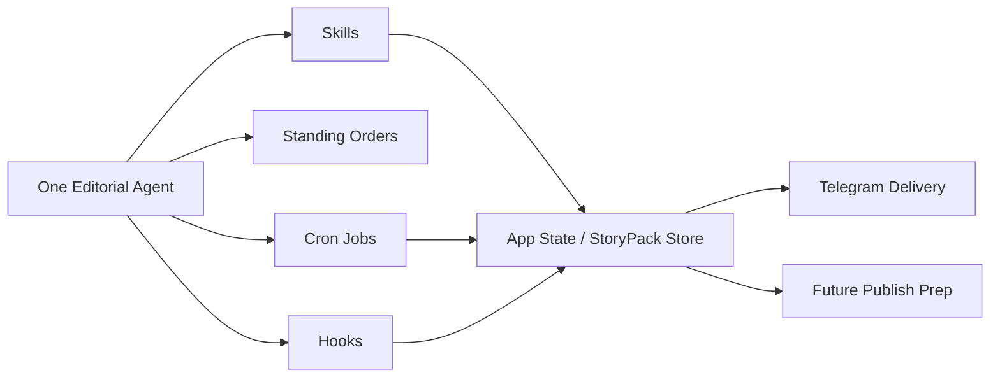

# Evaluation: OpenClaw Fit + Agentic Pattern Assessment

Date: 2026-03-23  
Status: Draft  
Scope: Assess the current `OpenClaw StoryPack Inbox` design against:

- OpenClaw official docs and source repo
- [Agentic Design Patterns](https://adp.xindoo.xyz/)
- Google Cloud's agentic pattern guidance at [Choose a design pattern for your agentic AI system](https://docs.cloud.google.com/architecture/choose-design-pattern-agentic-ai-system)
- The requirement source [信息过载时代，我的漏斗式阅读工作流](E:\File\self\github\agents\reading-agent\信息过载时代，我的漏斗式阅读工作流.md)

Note: the linked LINE/Jina article was not reliably retrievable during this pass, so the Google section below uses Google's official Cloud Architecture documentation as the primary source.

## Documents under review

- [Current design](E:\File\self\github\agents\planning\openclaw-storypack-inbox\01-design-v1.2.md)
- [Implementation plan](E:\File\self\github\agents\planning\openclaw-storypack-inbox\02-implementation-plan.md)
- [Test plan](E:\File\self\github\agents\planning\openclaw-storypack-inbox\03-test-plan.md)

## Executive Verdict

The current design is directionally correct, but it still needs one explicit reframing:

`This should be an editorial system orchestrated by OpenClaw, not a product whose business truth lives inside OpenClaw.`

That distinction matters because OpenClaw's own model is clear:

- the Gateway is the control plane
- agents are isolated brains with separate workspace, session store, and auth
- skills, hooks, standing orders, and cron jobs are the native extension surfaces
- memory files are prompt/bootstrap context, not a replacement for domain storage

The current StoryPack-centered design already fits the funnel article well. What it still needs is a more OpenClaw-native execution model:

- default to `single editorial agent + multiple narrow skills`
- use `cron + standing orders + hooks` for automation
- reserve `multi-agent` for true isolation boundaries, not for every pipeline stage
- keep `StoryPack`, `FeedbackEvent`, `DeliveryArtifact`, and queue state outside OpenClaw session memory
- if "OpenClaw-native UI" matters, prefer `Canvas / A2UI / channel actions` over inventing a parallel mini-app first

Verdict: `GOOD DESIGN, NEEDS OPENCLAW-NATIVE REFRAME`

## Why the core idea still holds

The requirement doc is not asking for "a stronger feed reader." It is asking for a stable information funnel:

- broad capture
- early noise reduction
- editorial compression
- human value confirmation
- long-term memory feedback

That is already reflected in the current design:

- `Source Registry -> Feed Ingestion -> StoryPack Builder -> Review Queue -> Telegram Digest -> Feedback Log`

This aligns with the article's own structure:

- FreshRSS as aggregation pool
- Digest as preprocessing
- Daily Review as editorial selection
- Lumina as long-term retention
- light rerank from downstream behavior

The current design also correctly chose `StoryPack` as the domain center, which is the right abstraction for "a reusable cognition unit" instead of just "another summarized article."

## What OpenClaw changes about the design

## 1. OpenClaw is the orchestration layer, not the business database

This is the strongest alignment between your requirement doc and OpenClaw itself.

The requirement article already says OpenClaw should mainly act as the orchestration layer. OpenClaw's own repo makes the same separation in different words: the Gateway is the control plane, while the product is the assistant. Its docs also show that agent memory is file-based workspace context such as `memory/YYYY-MM-DD.md` and `MEMORY.md`, which is useful for continuity but not suitable as the source of truth for a domain object like `StoryPack`.

Implication for your design:

- `StoryPack`, `FeedbackEvent`, `DeliveryArtifact`, `ReviewQueueSnapshot`, and provenance records should remain explicit application state
- OpenClaw memory should store operator instructions, standing context, durable preferences, and high-level decisions
- do not let `MEMORY.md` become the hidden storage layer for story lifecycle, ranking state, or delivery state

This validates the existing design choice to formalize `StoryPack` and `DeliveryArtifact` contracts.

## 2. Multi-agent should be optional, not the default architecture

OpenClaw's multi-agent model is heavier than "one task = one agent." In OpenClaw, one agent means:

- separate workspace
- separate `agentDir`
- separate auth profile storage
- separate session store
- separate routing/binding behavior

That is useful when you want:

- different personas
- separate credentials
- separate channel identities
- separate tool/sandbox policies

It is not the right default for each pipeline stage inside one editorial system.

Implication for your design:

- Phase 1 should not be implemented as `ingestor agent + scorer agent + delivery agent + publisher agent`
- Phase 1 should be `one editorial agent` with several skills and automations
- only split out a second agent if there is a real boundary, for example:
  - a browser-heavy fetcher with different sandbox/tool policy
  - a future publisher agent with platform-specific credentials and rate-limit concerns
  - a separate personal/work editorial brain

This is the biggest OpenClaw-specific correction to the current mental model.

## 3. Skills, hooks, cron jobs, and standing orders are the native primitives

OpenClaw gives you four especially relevant primitives:

- `skills`
  - task-local capabilities and repeatable procedures
- `cron jobs`
  - time-based execution with isolated or main-session delivery
- `standing orders`
  - persistent authority and execution rules loaded from workspace bootstrap files
- `hooks`
  - event-driven glue around lifecycle and gateway events

For this project, that leads to a clean mapping:

- `skills`
  - source fetch/extract
  - normalization
  - StoryPack building
  - digest composition
  - publish-prep
- `standing orders`
  - define the daily editorial program and approval boundaries
- `cron jobs`
  - schedule morning digest runs, retries, and maintenance passes
- `hooks`
  - log outcomes, write lightweight traces, sync event summaries, or trigger side effects on session/gateway events

This means the current design should talk less about "many agents" and more about "one OpenClaw program made of skills + automation."

## 4. Queue and concurrency must respect OpenClaw session semantics

OpenClaw serializes runs per session lane and allows safe parallelism across sessions. That is useful, but it also means you should avoid letting multiple agent sessions mutate the same editorial object without a stronger state owner.

Implication:

- OpenClaw sessions should execute jobs
- your application state should decide whether a `StoryPack` mutation is valid
- existing `version` and optimistic concurrency rules are correct and should stay outside session memory
- if you later add parallel fetchers, parallelize extraction and evidence gathering, not final StoryPack mutation rights

The current design's `StoryPack.version`, `FeedbackEvent` source-of-truth model, and `DeliveryArtifact.idempotency_key` are therefore reinforced by OpenClaw rather than weakened by it.

## 5. OpenClaw already has native control and delivery surfaces

This is the main place where the current design is least OpenClaw-native.

The current design assumes custom pages such as:

- `/sources`
- `/inbox`
- `/delivery`

That is a reasonable product design, but OpenClaw itself already exposes:

- Gateway-based execution
- Control UI
- Canvas / A2UI custom surfaces
- channel delivery, including Telegram
- CLI and runtime messaging primitives

Implication:

- if your goal is simply "make this run inside OpenClaw," do not rush to build a standalone admin-style web app
- if your goal is "ship a polished personal product surface," then the custom UI can still exist, but it should be treated as product UI sitting above the OpenClaw runtime, not as a reinvention of OpenClaw operations surfaces

Practical recommendation:

- Phase 1 runtime and operator controls should prefer OpenClaw-native surfaces where possible
- Telegram should be the first interactive review surface
- Canvas/A2UI should be the first custom UI candidate before a heavier bespoke web console
- only keep the custom `/sources /inbox /delivery` app plan if you explicitly want an independent product UI beyond OpenClaw's native control surfaces

## 6. Telegram is not just an output channel

The current design treats Telegram mostly as digest delivery. OpenClaw's channels model suggests a stronger path:

- deliver digest
- capture inline actions
- run quick approvals in-channel
- keep the first approval loop close to where the digest is consumed

Implication:

- `approve / reject / snooze / mark_for_publish` should be designed to work in Telegram first
- the inbox UI becomes a richer secondary surface, not the only review surface
- this reduces Phase 1 UI scope without weakening the core product loop

This fits both the funnel article and the current scope-reduction strategy.

## 7. Durable memory needs a write-through policy

The current design is correct to keep domain truth outside OpenClaw memory. But the inverse mistake is also possible: keeping all useful editorial conclusions out of memory entirely.

If future OpenClaw runs should benefit from earlier editorial judgment, you need a controlled write-through rule:

- application state remains source of truth
- selected outcomes are written into OpenClaw memory for future assistant context

Recommended write-through candidates:

- approved `StoryPack` summary
- `why_it_matters_today`
- `one_line_thesis`
- final user action such as `saved_to_kb` or `marked_for_publish`
- durable preference shifts, not raw noisy clickstream

This preserves correctness while still letting the OpenClaw assistant become more context-aware over time.

## Pattern assessment

## A. Against the requirement doc

The design is strongly aligned with the funnel article in four ways:

1. It preserves the funnel shape instead of flattening everything into one summarizer.
2. It keeps human approval near the retention/publication boundary.
3. It treats downstream feedback as light rerank, not total personalization.
4. It recognizes OpenClaw as an execution layer rather than the whole product.

Main gap versus the article:

- the current design still talks more about system modules than about the concrete OpenClaw operating program that would run daily
- it does not yet say which conclusions should be written back into OpenClaw memory versus kept only in app state

That gap is fixable.

## B. Against Agentic Design Patterns (ADP)

The current design uses the right ingredients, but it should map them more explicitly.

Recommended ADP mapping:

- `Prompt Chaining`
  - use for `ingest -> normalize -> cluster -> draft StoryPack -> compose digest`
- `Routing`
  - use for source strategy selection such as `feed`, later `browser`, later `Scrapling`
- `Parallelization`
  - use for independent source fetch and evidence extraction
- `Reflection`
  - use in narrow form for quality checks on summaries, titles, or score explanations
- `Tool Use`
  - use for feed access, browser automation, Telegram delivery, Lumina sync
- `Planning`
  - keep limited to content packaging or publish-prep; avoid making the whole ingest pipeline planner-driven
- `Multi-Agent Collaboration`
  - defer as a default; use only when isolation or parallel specialization is actually required
- `Memory Management`
  - keep OpenClaw memory for instructions/context and domain state in your own storage
- `Learning and Adaptation`
  - map to your light rerank loop, not to unconstrained autonomous retuning
- `Exception Handling and Recovery`
  - align with existing `retry`, `dead letter`, `quiet_but_useful`, and `manual split` logic
- `Human Collaboration`
  - align with the current review queue and publish intent gates
- `Prioritization`
  - align with ranking and queue ordering, especially `why_it_matters_today` and fallback selection
- `Goal Setting and Monitoring`
  - align with explicit KPIs such as false merge rate, stale action conflict rate, digest usefulness, and quiet-day fallback value
- `Guardrails`
  - align with escalation rules, ambiguous merge handling, and publish safety checks

ADP conclusion:

- the design is structurally compatible with ADP
- the main improvement is to mark which stages are deterministic workflow, which stages need routing, and which stages truly justify multi-agent collaboration
- it should also add explicit reprioritization, escalation, and monitoring rules rather than stopping at static queue scoring

## C. Against Google's agentic pattern guidance

Using Google's official architecture guidance, the current design should be viewed as a mixed-pattern system, but with a clear dominant pattern.

### Dominant pattern: deterministic workflow

Most of Phase 1 is a deterministic workflow:

- fetch from configured sources
- normalize into canonical items
- cluster into StoryPacks
- queue for review
- build delivery artifact
- send digest

Google's guidance suggests predefined workflow patterns when the workload is predictable and structured. That fits your Phase 1 extremely well.

### Secondary pattern: parallel

Parallelism is justified in:

- multi-source fetch
- evidence extraction
- optional fallback enrichment

It is not justified for final editorial judgment unless each worker has a truly independent role and the merge logic is explicit.

### Secondary pattern: review and critique

This fits:

- summary refinement
- claim/evidence validation
- export package quality checks

It should not become an everywhere-loop. Use it surgically where reliability matters.

### Required pattern: human-in-the-loop

This is mandatory for:

- approve / reject / snooze
- mark for publish
- long-term knowledge retention
- later social publishing

Your current design already assumes this and is correct to do so.

### Escape hatch: custom logic

Custom logic is the right place for:

- `quiet_but_useful`
- public-interest override
- stale-version conflict handling
- fallback from one fetch strategy to another

Google conclusion:

- the design should remain mostly workflow-driven
- it should avoid jumping too early to AI-routed coordinator patterns
- custom logic should be added only where your funnel logic is genuinely product-specific
- if you want to mirror Google's pattern framing more explicitly, decompose the system into smaller skill roles such as tool-wrapper, generator, reviewer, inversion, and pipeline stages

## Recommended OpenClaw-native architecture

Use this as the default runtime model:

Interpretation:

- one editorial agent owns the operating context
- skills do the work
- cron decides when to run
- standing orders define what the program is allowed to do
- hooks glue lifecycle events and local automation
- explicit app state remains the source of truth

## Recommended skill split

Phase 1 recommended skill inventory:

- `source-registry`
  - validate/add/disable feed sources
- `feed-ingest`
  - fetch unread candidates from the aggregation layer
- `content-extract`
  - pull canonical URL, metadata, body, evidence fragments
- `storypack-builder`
  - cluster and update versioned StoryPacks
- `review-queue`
  - build `ReviewQueueSnapshot`
- `digest-composer`
  - compose `daily_digest` or `quiet_but_useful`
- `telegram-delivery`
  - send and ack `DeliveryArtifact`
- `feedback-sync`
  - turn inline feedback into `FeedbackEvent`
- `lumina-sync`
  - optional later-phase retention/export bridge
- `memory-sync`
  - write selected editorial conclusions into OpenClaw memory files

This is enough for a strong Phase 1. It is also much more OpenClaw-native than inventing many semi-overlapping agents early.

## Recommended agent split

Default:

- `editorial`
  - the main agent for the whole system

Optional later:

- `fetcher`
  - only if browser/Scrapling execution needs a different tool/sandbox boundary
- `publisher`
  - only when social platform automation needs separate credentials, approval rules, and observability

If you cannot explain a new agent in terms of `different workspace + different auth + different routing + different safety policy`, it should probably stay a skill instead.

## Concrete design changes recommended now

These changes should be added to the design pack before implementation in macOS:

1. Add an `OpenClaw Role and Boundaries` section to the main design doc.
   - State explicitly that OpenClaw is the orchestration/runtime layer.
   - State explicitly that domain truth lives in StoryPack-oriented application state.

2. Add a `Pattern Mapping` section.
   - For each stage, mark `workflow`, `parallel`, `review/critique`, `human-in-the-loop`, or `custom logic`.

3. Add a `Skills vs Agents vs Hooks vs Cron` matrix.
   - This removes ambiguity about which primitive owns which responsibility.

4. Change default wording from `multi-agent pipeline` to `single-agent editorial program with pluggable skills`.
   - Multi-agent becomes a selective extension, not the base plan.

5. Add a `State Ownership` section.
   - `OpenClaw memory`: preferences, standing instructions, durable operator context
   - `application store`: StoryPack, queue, feedback, provenance, delivery, ranking projections

6. Add an `Interaction Surface Strategy` section.
   - `Telegram`: first interactive review surface
   - `Canvas/A2UI`: first custom visual surface
   - custom web app: optional product layer, not a Phase 1 assumption

7. Add a `Memory Write-Through Policy` section.
   - Define which approved outcomes are mirrored into OpenClaw memory and why.

8. Add a `Monitoring and Escalation` section.
   - Include false-merge rate, stale-action conflict rate, delivery failure rate, quiet-but-useful usefulness, and low-confidence/manual-review lanes.

## Suggested pattern map for the current design

| Stage | Recommended pattern | OpenClaw primitive | Notes |
|---|---|---|---|
| Source fetch | Workflow + Routing | Skill + Cron | Default `feed`; later branch to `browser` or `Scrapling` |
| Extraction | Parallel | Skill | Safe place for fan-out |
| Canonicalization | Workflow | Skill | Deterministic transformation |
| StoryPack update | Workflow + Custom Logic | Skill | Versioned writes, merge/split rules |
| Review queue | Prioritization + Human-in-the-loop | Skill + app state | Queue semantics stay explicit |
| Digest composition | Workflow + Review/Critique | Skill | Good place for quality checks |
| Quiet-day fallback | Custom Logic | Skill | Product-specific rule engine |
| Telegram delivery | Workflow | Skill + Cron | Must respect idempotency contract |
| Feedback capture | Human-in-the-loop | Channel action + Skill | Convert action to `FeedbackEvent` |
| Long-term learning | Learning/Adaptation | App logic + memory | Keep lightweight |

## Final assessment

### What is strong already

- `StoryPack` is the right core object.
- Phase 1 scope is finally correct.
- Human review remains central.
- Delivery and queue contracts are being treated seriously.
- The design does not collapse into a blind summarizer.

### What still needs reframing

- Do not equate "many steps" with "many agents."
- Do not treat OpenClaw memory/session state as business storage.
- Do not move too quickly to AI-routed coordination where deterministic workflow is enough.
- Do not let browser/Scrapling complexity pollute Phase 1's operating model.
- Do not assume a bespoke `/sources /inbox /delivery` app is the first OpenClaw-native UI.
- Do not waste Telegram as a passive sink when it can be the first approval surface.

### Final call

If implemented as:

- one editorial agent
- narrow skills
- cron + standing orders
- explicit StoryPack state store
- Telegram as first delivery surface

then the current design is not only viable, but well matched to OpenClaw.

If implemented as:

- many long-lived agents
- business truth stored in memory files or session context
- planner-driven orchestration everywhere

then the design will drift away from both the funnel article and OpenClaw's strengths.

Status: `APPROVED WITH REFRAME`

## Sources

- [OpenClaw docs index](https://docs.openclaw.ai/index)
- [OpenClaw architecture](https://docs.openclaw.ai/concepts/architecture)
- [OpenClaw source repo](https://github.com/openclaw/openclaw)
- [OpenClaw memory](https://docs.openclaw.ai/concepts/memory)
- [OpenClaw skills](https://docs.openclaw.ai/tools/skills)
- [OpenClaw channels](https://docs.openclaw.ai/channels)
- [OpenClaw CLI message](https://docs.openclaw.ai/cli/message)
- [OpenClaw hooks](https://docs.openclaw.ai/automation/hooks)
- [OpenClaw standing orders](https://docs.openclaw.ai/automation/standing-orders)
- [OpenClaw cron jobs](https://docs.openclaw.ai/automation/cron-jobs)
- [OpenClaw multi-agent routing](https://docs.openclaw.ai/concepts/multi-agent)
- [OpenClaw command queue](https://docs.openclaw.ai/concepts/queue)
- [OpenClaw Control UI](https://docs.openclaw.ai/web/control-ui)
- [OpenClaw Canvas / A2UI](https://docs.openclaw.ai/platforms/mac/canvas)
- [OpenClaw Pi integration architecture](https://docs.openclaw.ai/pi)
- [Agentic Design Patterns](https://adp.xindoo.xyz/)
- [ADP: Memory Management](https://adp.xindoo.xyz/original/Chapter%208_%20Memory%20Management/)
- [ADP: Goal Setting and Monitoring](https://adp.xindoo.xyz/original/Chapter%2011_%20Goal%20Setting%20and%20Monitoring)
- [ADP: Exception Handling and Recovery](https://adp.xindoo.xyz/original/Chapter%2012_%20Exception%20Handling%20and%20Recovery/)
- [ADP: Human-in-the-Loop](https://adp.xindoo.xyz/original/Chapter%2013_%20Human-in-the-Loop/)
- [ADP: Guardrails / Safety Patterns](https://adp.xindoo.xyz/original/Chapter%2018_%20Guardrails_Safety%20Patterns/)
- [ADP: Evaluation and Monitoring](https://adp.xindoo.xyz/original/Chapter%2019_%20Evaluation%20and%20Monitoring/)
- [ADP: Prioritization](https://adp.xindoo.xyz/original/Chapter%2020_%20Prioritization/)
- [Google Cloud: Choose a design pattern for your agentic AI system](https://docs.cloud.google.com/architecture/choose-design-pattern-agentic-ai-system)
