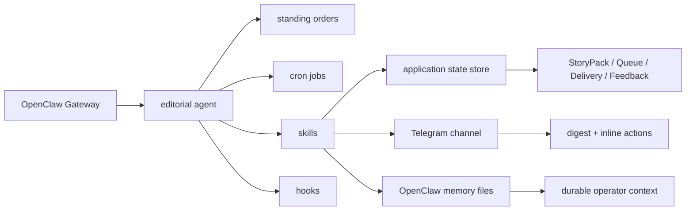
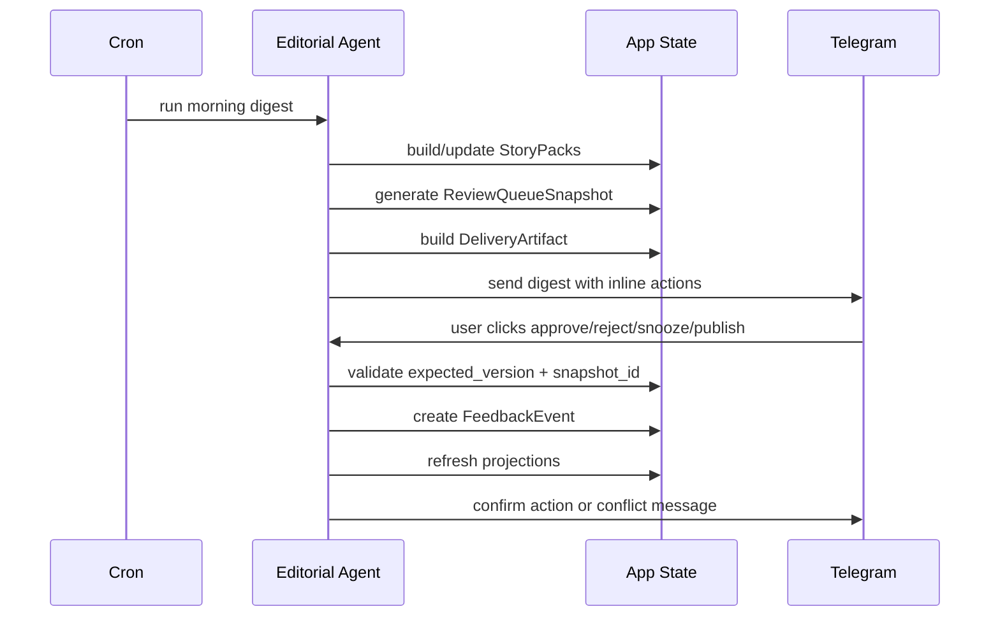

# OpenClaw Runtime Blueprint: StoryPack Inbox Phase 1.3

Generated: 2026-03-23  
Status: Draft  
Purpose: define how the Phase 1 design should actually live inside OpenClaw at runtime

## Runtime Goal

Turn the design pack into one concrete OpenClaw operating program:

- one editorial agent
- several narrow skills
- scheduled daily runs
- Telegram-first delivery and feedback
- selective memory write-through
- optional Canvas surface later

This document is about runtime layout, not product scope.

## Runtime Topology



## Default Agent Layout

### Main agent

- `editorial`

Responsibilities:

- own the daily editorial program
- invoke skills
- react to cron-triggered runs
- deliver to Telegram
- process incoming actions
- write selected durable conclusions into memory

### Deferred agents

Do not create these in Phase 1 by default:

- `fetcher`
- `publisher`
- `researcher`

Only add them if you later need separate auth, workspace, or tool policy.

## Skill Inventory

### Required Phase 1 skills

- `source-registry`
- `feed-ingest`
- `content-extract`
- `storypack-builder`
- `review-queue`
- `digest-composer`
- `telegram-delivery`
- `feedback-sync`
- `memory-sync`

### Optional later skills

- `browser-fetch`
- `scrapling-fetch`
- `lumina-sync`
- `publish-prep`

## Standing Orders Blueprint

Standing orders should encode the editorial rules that must survive across runs.

### Recommended standing order themes

- only use feed-based ingestion in Phase 1
- prefer deterministic workflow over improvisational planning
- never treat memory files as canonical StoryPack state
- always require `expected_version` on review actions
- Telegram is the first review surface
- only write durable, approved conclusions into memory
- escalate ambiguous merges or repeated delivery anomalies

### Example standing order topics

```text
1. Daily editorial mission
2. Approval boundaries
3. State ownership rules
4. Memory write-through rules
5. Quiet-but-useful fallback rules
6. Escalation conditions
```

## Cron Blueprint

Phase 1 should stay small and predictable.

### Recommended jobs

#### Morning digest job

- fetch enabled feeds
- normalize candidates
- update StoryPacks
- generate queue snapshot
- build digest artifact
- send Telegram digest

#### Retry recovery job

- inspect failed delivery artifacts
- retry eligible sends
- stop at dead-letter threshold

#### Maintenance job

- summarize previous run health
- detect repeated stale-action conflicts
- detect repeated merge anomalies
- detect memory sync failures

## Cron Timing Suggestions

Use the user's locale time zone.

Suggested initial schedule:

- morning digest: once per day in the user's preferred morning window
- retry recovery: hourly during waking hours
- maintenance: once per day after digest cycle

The exact RRULEs can be decided later in macOS setup.

## Hook Blueprint

Hooks should be light and non-authoritative.

### Appropriate hook uses

- write execution traces
- append operational logs
- emit lightweight alerts
- trigger post-run summaries

### Inappropriate hook uses

- mutating StoryPack truth directly
- bypassing delivery idempotency
- updating queue state outside the canonical projection path

## Telegram Review Flow

Telegram is both delivery surface and first approval surface.



### Telegram action payload requirements

Every inline action should resolve to:

- `story_pack_id`
- `expected_version`
- `snapshot_id`
- `action`
- `idempotency_key`

### Telegram action responses

- success acknowledgment
- stale-version conflict notice
- invalid action notice

## Memory Layout Blueprint

OpenClaw memory should store durable context, not canonical product state.

### Recommended memory categories

- daily editorial notes
- durable editorial preferences
- approved summaries worth remembering
- stable thesis fragments

### Recommended write-through targets

```text
memory/
  editorial/
    preferences.md
    approved-storypacks/
      2026-03-23-sp_001.md
      2026-03-23-sp_004.md
```

### Suggested memory entry structure

```markdown
# StoryPack sp_001

- Version: 4
- Topic: ...
- Why it matters today: ...
- One-line thesis: ...
- Final action: marked_for_publish
- Source of truth: application state
```

### Hard rule

A memory file is a mirrored narrative record, not the authoritative state object.

## Canvas / A2UI Blueprint

Canvas is optional in Phase 1, but if used, it should be a thin inspection surface.

### Good Canvas use cases

- source health summary
- current queue overview
- delivery history
- escalation review list

### Bad Canvas use cases

- inventing a separate queue model
- bypassing Telegram-first action semantics
- creating a second source of truth for review state

## Failure And Recovery Blueprint

### Feed failure

- mark source run failure
- continue remaining sources
- keep failure visible in ops summary

### StoryPack merge ambiguity

- assign `NEEDS_MANUAL_SPLIT`
- suppress unsafe auto-approval path

### Delivery failure

- preserve artifact
- retry same artifact
- dead-letter after threshold

### Memory sync failure

- preserve canonical StoryPack outcome
- mark memory write failure explicitly
- retry independently if safe

## OpenClaw-side Directory / Config Blueprint

Exact file names can vary later, but the runtime should conceptually separate these layers:

```text
openclaw/
  agents/
    editorial/
      standing-orders/
      memory/
  skills/
    source-registry/
    feed-ingest/
    content-extract/
    storypack-builder/
    review-queue/
    digest-composer/
    telegram-delivery/
    feedback-sync/
    memory-sync/
  automation/
    cron/
    hooks/
```

## Repository Bootstrap Blueprint

This repo should be structured so OpenClaw can clone it and discover what to install without human scavenger work.

### Bootstrap principle

`The repository itself must explain how to become an OpenClaw runtime.`

### Required discoverability

- a root README that explains the install path
- a stable OpenClaw directory subtree
- a stable skills subtree
- a stable docs/planning subtree
- clear environment and secret requirements

### Recommended repo-level shape

```text
repo-root/
  README.md
  planning/
    openclaw-storypack-inbox/
  openclaw/
    agents/
    skills/
    automation/
    memory/
  bootstrap/
    install.md
    validate.md
```

### Bootstrap boundary rule

If OpenClaw cannot infer where agent config, skills, automation, and memory conventions live from the repo alone, the repo is not packaged correctly yet.

## Phase 1 Runtime Acceptance Checklist

- one editorial agent can run the full loop
- all Phase 1 tasks map cleanly to skills, cron, hooks, or channels
- Telegram can deliver and collect first-round review actions
- memory write-through is selective and non-canonical
- no business-critical state depends on session memory
- no extra agent exists without a real isolation reason
- the cloned repo is sufficient for OpenClaw to discover the install layout

## Decisions To Finalize During macOS Setup

- exact cron schedule
- Telegram target and topic routing
- memory file path conventions
- whether Canvas is included in Phase 1 or deferred
- whether contracts are exposed via HTTP, RPC, or internal service interfaces first
